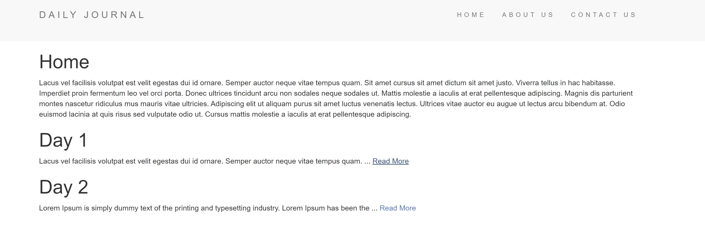
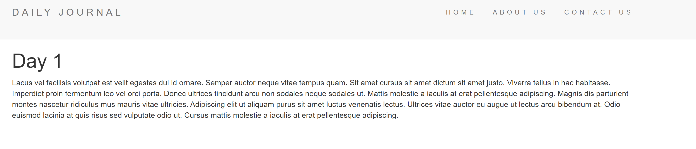

# Blog
***A simple blog app where you can see/add things.*** 

## Instructions
##### 1. Clone ***( using `git clone` )*** or Download the folder ***( using ***`Download ZIP`*** option )*** #####
##### 2. Open your code editor and add the project folder #####
##### 3. Open the terminal and install all required dependencies with ***`npm i`*** #####
##### 5. type ***`nodemon app.js`*** to start the app #####

[x] If you want to compose something navigate to /compose

 ###### 🗒️ *Enjoy using the app !* 🗒️ ######
